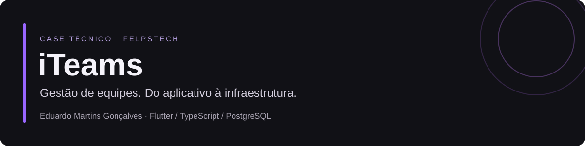

  

  <a href="https://iteams.felpstech.com">Acessar o produto</a> ·
  <a href="docs/architecture.md">Arquitetura</a> ·
  <a href="docs/engineering.md">Decisões de engenharia</a> ·
  <a href="https://www.linkedin.com/in/eduardomartinsdev/">LinkedIn</a>

## O projeto

O **iTeams** é uma plataforma da FelpsTech para organizar o trabalho de equipes. Reúne projetos, tarefas, chamados, registro de tempo, conversas e agenda, com recursos de gamificação como XP, níveis e conquistas.

Uma pessoa pode participar de diferentes organizações. Em cada uma, suas permissões e seu contexto de trabalho são próprios. Esse requisito atravessa o produto: das consultas ao banco às notificações em tempo real.

Este repositório apresenta o projeto e as decisões por trás dele. O código da aplicação é proprietário e permanece em repositório privado.

## Minha participação

Sou **Eduardo Martins Gonçalves**, desenvolvedor na FelpsTech e responsável pelo desenvolvimento do iTeams. Minha atuação abrange o cliente em Flutter, a API em TypeScript, a modelagem dos dados, as integrações, os testes e a publicação da aplicação.

O trabalho também envolve investigar problemas depois da entrega: comportamento entre plataformas, renovação de sessões, atualização de dados em tempo real e acesso a arquivos são exemplos de decisões que precisam funcionar em conjunto.

## O que a plataforma reúne

| Área | Funcionalidades |
| --- | --- |
| Organização do trabalho | Projetos, tarefas em kanban, chamados e agenda |
| Equipe | Participação em múltiplas organizações, convites e permissões por papel |
| Colaboração | Chat, avisos e atualizações em tempo real |
| Acompanhamento | Registro de tempo, dashboards e relatórios |
| Gamificação | XP, níveis, conquistas e sequências de atividade |
| Integrações | GitHub, Discord, notificações via Firebase e armazenamento compatível com S3 |

A disponibilidade das integrações depende da configuração da instalação. O cliente possui suporte no projeto para web, Android, iOS e desktop; isso não implica distribuição em todas as lojas.

## Tecnologias

| Parte | Escolhas principais |
| --- | --- |
| Aplicativo | Flutter, Dart, Riverpod, go_router e Dio |
| API | TypeScript, Node.js, Fastify e InversifyJS |
| Persistência | PostgreSQL e Drizzle ORM |
| Serviços auxiliares | Redis, WebSocket, Firebase e S3 |
| Qualidade | Vitest, Testcontainers, Flutter Test e Biome |
| Entrega | Docker, GitHub Actions, pnpm e Turborepo |

## Três desafios que representam o trabalho

### 1. Manter cada organização no seu contexto

Uma identidade pode pertencer a várias empresas, mas uma operação precisa acontecer no contexto certo. A API associa o contexto de organização à sessão autenticada e aplica esse limite no acesso aos dados. As permissões definem o que cada pessoa pode fazer dentro dele.

O projeto inclui testes de isolamento com banco temporário. A existência desses testes é parte da abordagem de qualidade; este case não representa uma auditoria independente de segurança.

### 2. Cuidar da sessão em diferentes plataformas

O cliente compartilha a base Flutter entre plataformas, enquanto armazenamento, navegação e comportamento de sessão exigem atenção ao ambiente. A renovação de tokens precisa coordenar requisições simultâneas para evitar que várias tentativas de refresh disputem a mesma sessão.

### 3. Fazer colaboração funcionar além das telas

Chat, tarefas e notificações dependem de autorização, persistência e entrega de eventos. Arquivos também precisam respeitar a visibilidade do recurso ao qual pertencem. Esses fluxos aproximam interface, backend e operação.

[Ler as decisões e seus limites →](docs/engineering.md)

## Como conhecer o produto

O [iTeams publicado](https://iteams.felpstech.com) abre na tela de autenticação. O link permite conhecer a entrada do produto; as funcionalidades internas exigem acesso. Este repositório não disponibiliza credenciais de demonstração.

Para conversar sobre o projeto e minha participação: [LinkedIn](https://www.linkedin.com/in/eduardomartinsdev/) ou [GitHub](https://github.com/coopas).

## Sobre este case

A descrição foi preparada a partir da estrutura do projeto, dos manifestos, da documentação técnica e da configuração de CI consultados em setembro de 2026. Os diagramas são simplificados; não representam a topologia da infraestrutura de produção.

Não foram publicados números de clientes, usuários, receita ou desempenho. A presença de uma funcionalidade no código não comprova sua adoção ou disponibilidade em toda instalação.

---

iTeams · FelpsTech · Case técnico por Eduardo Martins Gonçalves. Este repositório documenta o trabalho; não distribui o software.
