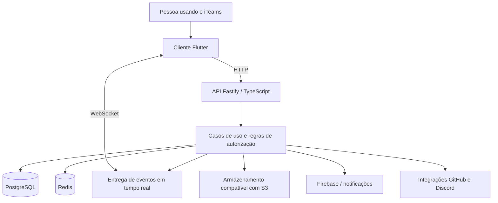
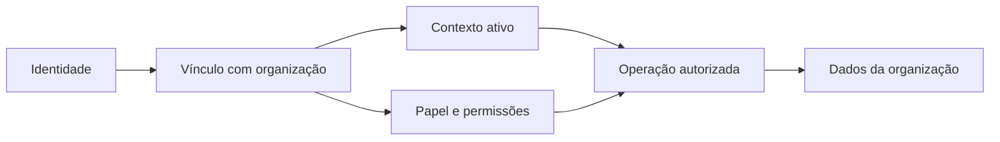

# Arquitetura

[← Voltar ao case](../README.md)

O iTeams usa um monorepo com duas aplicações principais: um cliente Flutter e uma API TypeScript. Esta página descreve as responsabilidades de cada parte em nível de produto.

## Visão geral

O diagrama agrupa responsabilidades. Serviços externos dependem de configuração e não são requisitos de todos os fluxos.

## Cliente

Flutter concentra a interface e os fluxos compartilhados. Riverpod organiza estado e dependências; go_router resolve navegação; Dio centraliza a comunicação HTTP.

As funcionalidades são organizadas por área do produto. Componentes compartilhados atendem à navegação, às permissões e à consistência visual. Recursos de desktop e mobile exigem tratamento específico de plataforma.

## API

O backend separa quatro responsabilidades:

| Camada | Responsabilidade |
| --- | --- |
| Apresentação | Receber requisições, validar entradas e devolver respostas |
| Aplicação | Coordenar os casos de uso |
| Domínio | Expressar regras e políticas |
| Infraestrutura | Implementar persistência, integrações e serviços técnicos |

Fastify recebe o tráfego HTTP e WebSocket. Drizzle faz a integração com PostgreSQL. A composição das dependências usa InversifyJS.

## Identidade, organização e permissão

São conceitos diferentes: a identidade representa a pessoa; o vínculo conecta essa pessoa a uma organização; o papel determina suas permissões naquele contexto.

O isolamento combina contexto autenticado e restrições no acesso aos dados. Uma função que administra uma equipe não deve, por isso, conseguir acessar outra organização.

## Qualidade e entrega

A configuração de CI contém lint, verificação de tipos, testes da API, testes de isolamento com Testcontainers, análise e testes Flutter, além de build web. Docker e os workflows de entrega dão suporte à publicação.

Essa descrição registra a configuração consultada, não uma execução de todos os testes durante a preparação do case. Não são feitas afirmações de cobertura percentual, disponibilidade ou capacidade de carga.
